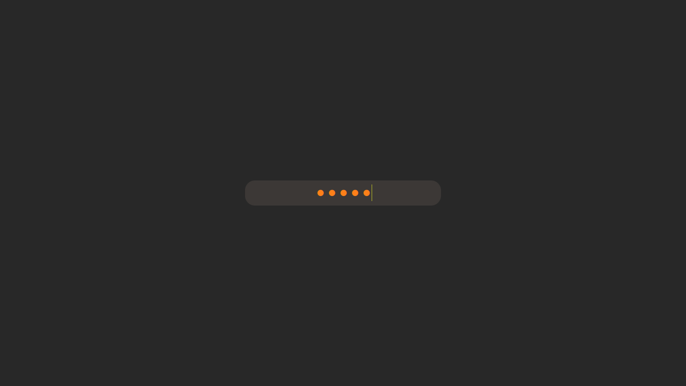

# A Minimal SDDM Theme

Inspired by and referenced from [stepanzubkov/where-is-my-sddm-theme](https://github.com/stepanzubkov/where-is-my-sddm-theme)



## Help

```
Show help - F1
Cycle select next user - alt+F2
Cycle select next session - alt+F3
Suspend - F10 [fn+F10]
Poweroff - F11 [fn+F11]
Reboot - F12 [fn+F12]
```

> Note:
> Mouse Cursor is hidden and will show up on pressing `F1` for help.

## NixOS Installation
### In configuration directory

> sddm-gruvbox.nix
```nix
{ pkgs }:

pkgs.stdenv.mkDerivation {
  name = "sddm-gruvbox";
  src = pkgs.fetchFromGitHub {
    owner = "scientiac";
    repo = "gruvbox-minimal-sddm";
    rev = "af0e63389031619edbe93d71f44a5ece50edc1a2";
    sha256 = "01jclmwz93z19644zq8rsi6lw8nxlaaszr4fyllw4kv71q5c19q8";
  };
  installPhase = ''
    mkdir -p $out
    cp -R ./* $out/
   '';
}
```

> configuration.nix
```nix
services.xserver = {
    displayManager = {
        sddm.enable = true;
        sddm.theme = "${import ./sddm-gruvbox.nix {inherit pkgs;}}";
        };
    };
};
```

### Fixing Fonts

> configuration.nix
```nix
  fonts = {
    fontDir.enable = true;
    fontconfig = {
      enable = true;
      defaultFonts = { 
        monospace = ["FantasqueSansMNerdFont"];
      };
    };
    packages = with pkgs; [
      (nerdfonts.override {fonts = ["FantasqueSansMono"];})
    ];
  };
```
